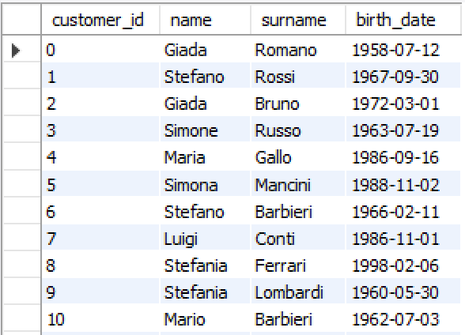
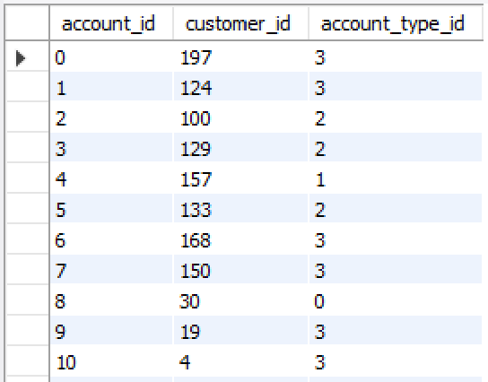
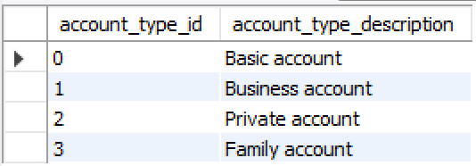
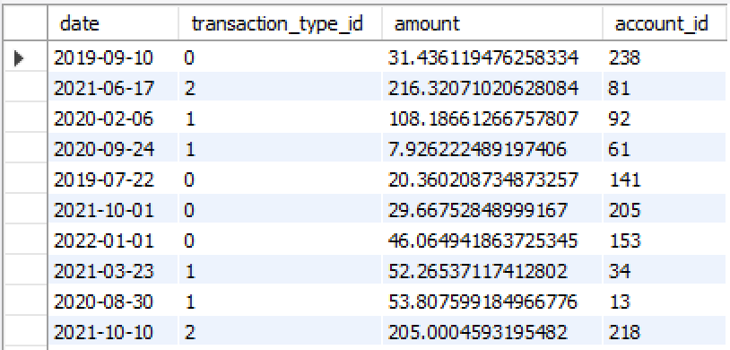
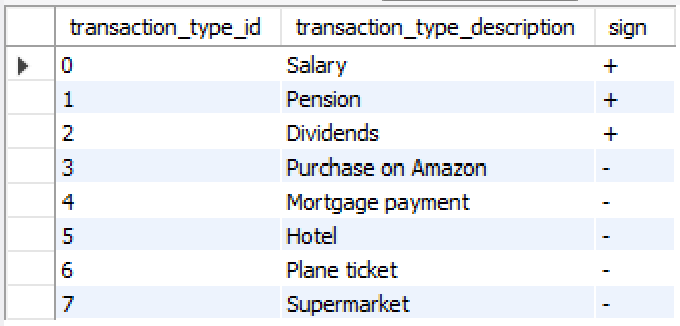

# SQL Project: customer analysis of a bank

Hello everyone, thank you for being here! :blush:

The aim of this project is the creation of a denormalized table for the customer behavior analysis of a bank, starting from the database contained in the file `banking_db.sql`, which provides information on the accounts and the transactions of the customers of a bank. The resulting table contains the features for a potential supervised learning model.

The database is made up of 5 tables:

* `customer`:

* `account`:

* `account_type`:

* `transaction`:

* `transaction_type`:

The result of the project is a denormalized table, exported to a CSV file called `denormalized_table.csv`, whose fields are:

* `customer_id`;
* the customer age;
* the total number of outgoing transactions;
* the total number of incoming transactions;
* the total expenditure;
* the total income;
* the total number of accounts;
* the total number of accounts by type (one indicator per type);
* the total number of outgoing transactions by type (one indicator per type);
* the total number of incoming transactions by type (one indicator per type);
* the total expenditure by account type (one indicator per type);
* the total income by account type (one indicator per type).
